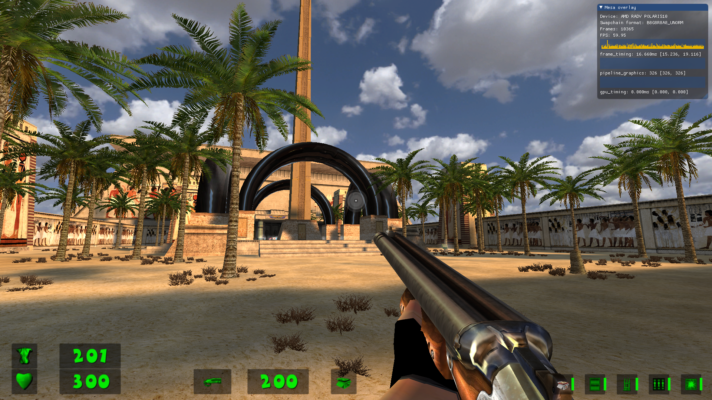
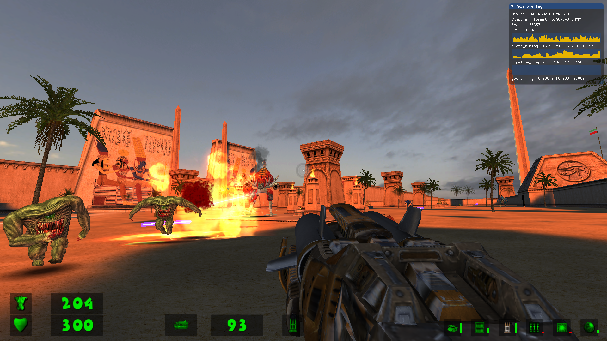
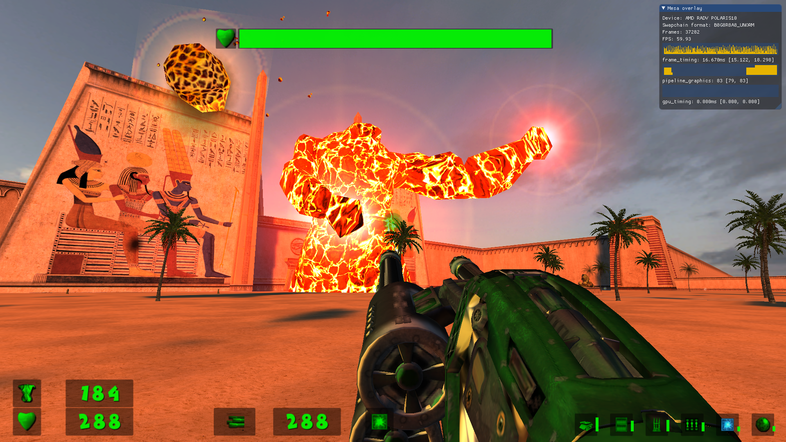
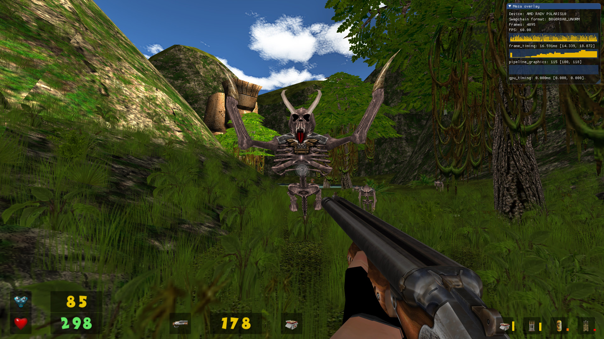
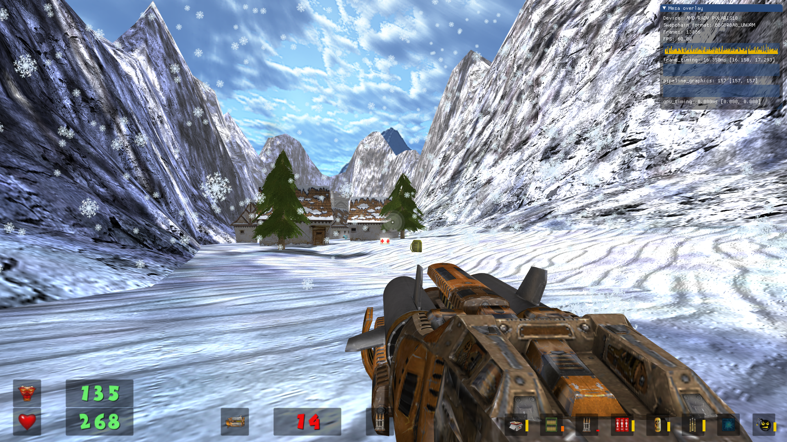
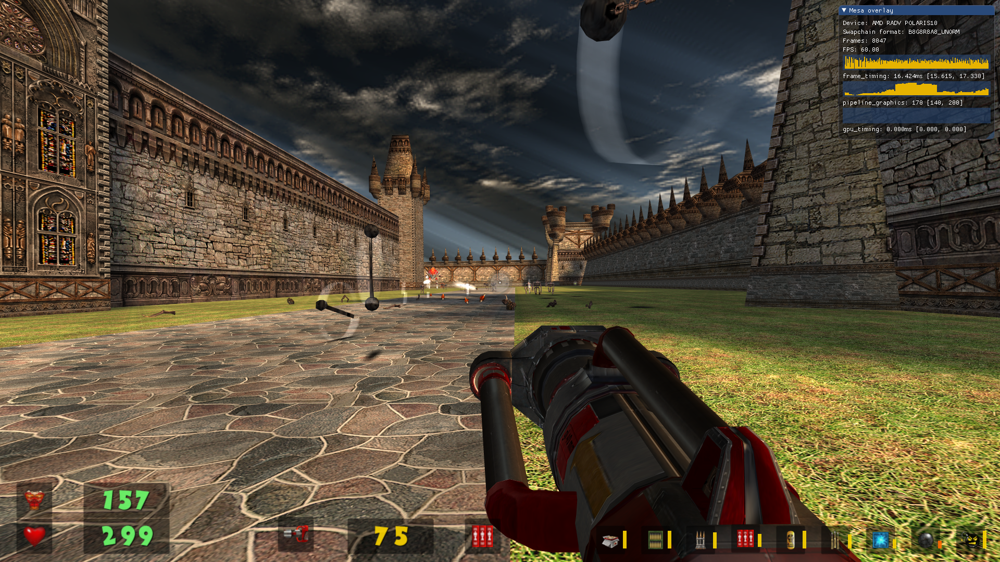

<!--

-->
<h1 align="center">
  
   
  SeriousSamClassic-VK
</h1>

<b>This is a snap for SeriousSamClassic-VK</b>

<!-- Uncomment and modify this when you are provided a build status badge

-->

<!-- Uncomment and modify this when you have a screenshot

-->

   
  SeriouSamClassic-VK is a family of enhanced ports of the Serious-Engine for running on modern operating systems.
  It runs on Windows, Linux, FreeBSD, macOS and adds new features not found in the games as originally
  published by Croteam.

## Version
1.10.6d

## Installation
([Don't have snapd installed?](https://snapcraft.io/docs/core/install))

### From the store
This snap is now in the store, simply run

    $ sudo snap install serioussam-vk --beta

### Manually
Clone this repo and run

    $ snapcraft

in the git repo (serioussam-vk-snap). Then install the produced snap with

    $ snap install *.snap --dangerous

## Game data

  This package only provides the engine, you need a valid copy of the (proprietary) game data to launch the game.
  When you first start the game, you will be asked to place your game data along the following paths:

    ~/snap/serioussam-vk/current/.local/share/Serious-Engine/serioussam

    ~/snap/serioussam-vk/current/.local/share/Serious-Engine/serioussamse

  You can place game data in these paths before starting the game. Then the game will start immediately.

## Running SeriousSamClassic-VK
Run it from shell:

    $ serioussam-vk

or

    $ serioussam-vk.se

or simply run the desktop entry, called:  
  
**Serious Sam The First Encounter**,  
**Serious Sam The Second Encounter**.

## Running SeriousSamClassic-VK with XPLUS modification
Run it from shell:

    cd ~/.
    wget https://archive.org/download/sam-tfe-xplus/SamTFE-XPLUS.tar.xz
    wget https://archive.org/download/sam-tse-xplus/SamTSE-XPLUS.tar.xz
    tar -xJvpf SamTFE-XPLUS.tar.xz -C ~/snap/serioussam-vk/current/.local/share/Serious-Engine/serioussam
    tar -xJvpf SamTSE-XPLUS.tar.xz -C ~/snap/serioussam-vk/current/.local/share/Serious-Engine/serioussamse

Next, run the modification from the game menu

## Known Issues

* There is no multiplayer compatibility between Windows and *nix systems.

## Screenshots
<h1 align="center">
  
   
</h1>

SeriousSamClassic-VK running on Linux with XPLUS Mod. Metropolis

<h1 align="center">
  
   
</h1>

SeriousSamClassic-VK running on Linux with XPLUS Mod. Alley Of Sphinxes

<h1 align="center">
  
   
</h1>

SeriousSamClassic-VK running on Linux with XPLUS Mod. Alley Of Sphinxes

<h1 align="center">
  
   
</h1>

SeriousSamClassic-VK running on Linux with XPLUS Mod. Sierra de chiapas

<h1 align="center">
  
   
</h1>

SeriousSamClassic-VK running on Linux with XPLUS Mod. Land of the Damned

<h1 align="center">
  
   
</h1>

SeriousSamClassic-VK running on Linux with XPLUS Mod. The Grand Cathedral

## Upstream Project
https://github.com/tx00100xt/SeriousSamClassic-VK

 

## Licenses
Serious Engine is licensed under the GNU GPL v2 (see LICENSE file).

See https://raw.githubusercontent.com/tx00100xt/SeriousSamClassic-VK/main/LICENSE

## Remaining tasks

  - [x] Fork the [Snapcrafters template](https://github.com/snapcrafters/fork-and-rename-me) repository to your own GitHub account.
    - If you have already forked the Snapcrafter template to your account and want to create another snap, you'll need to use GitHub's [Import repository](https://github.com/new/import) feature because you can only fork a repository once.
  - [x] Rename the forked Snapcrafters template repository
  - [x] Update the description of the repository
  - [x] Update logos and references to `[Project]` and `[my-snap-name]`
  - [x] Create a snap that runs in `devmode`
  - [x] Register the snap in the store, **using the preferred upstream name**
  - [x] Add a screenshot to this `README.md`
  - [x] Publish the `devmode` snap in the Snap store edge channel
  - [x] Add install instructions to this `README.md`
  - [x] Update snap store metadata, icons and screenshots
  - [x] Convert the snap to `strict` confinement, or `classic` confinement if it qualifies
  - [x] Publish the confined snap in the Snap store beta channel
  - [x] Update the install instructions in this `README.md`
  - [x] Post a call for testing on the [Snapcraft Forum](https://forum.snapcraft.io) - [link to the post](https://forum.snapcraft.io/t/call-for-testing-for-serioussamclassic-vk/38863)
  - [ ] Make a post in the [Snapcraft Forum](https://forum.snapcraft.io) asking for a transfer of the snap name from you to snapcrafters - [link]()
  - [ ] Ask a [Snapcrafters admin](https://github.com/orgs/snapcrafters/people?query=%20role%3Aowner) to fork your repo into github.com/snapcrafters, and configure the repo for automatic publishing into edge on commit
  - [ ] Add the provided Snapcraft build badge to this `README.md`
  - [ ] Publish the snap in the Snap store stable channel
  - [ ] Update the install instructions in this `README.md`
  - [ ] Post an announcement in the [Snapcraft Forum](https://forum.snapcraft.io) - [link]()
  - [ ] Submit a pull request or patch upstream that adds snap install documentation - [link]()
  - [ ] Submit a pull request or patch upstream that adds the `snapcraft.yaml` and any required assets/launchers - [link]()
  - [x] Add upstream contact information to the `README.md`  
  - If upstream accept the PR:
    - [ ] Request upstream create a Snap store account
    - [ ] Contact the Snap Advocacy team to request the snap be transferred to upstream
  - [ ] Ask the Snap Advocacy team to celebrate the snap - [link]()

<!--
## The Snapcrafters

|  |
| :---: |
| [Your Name](https://github.com/yourname/) |
--> 

<!-- Uncomment and modify this when you have upstream contacts
## Upstream

|  |
| :---: |
| [Upstream Name](https://github.com/upstreamname) |
-->
